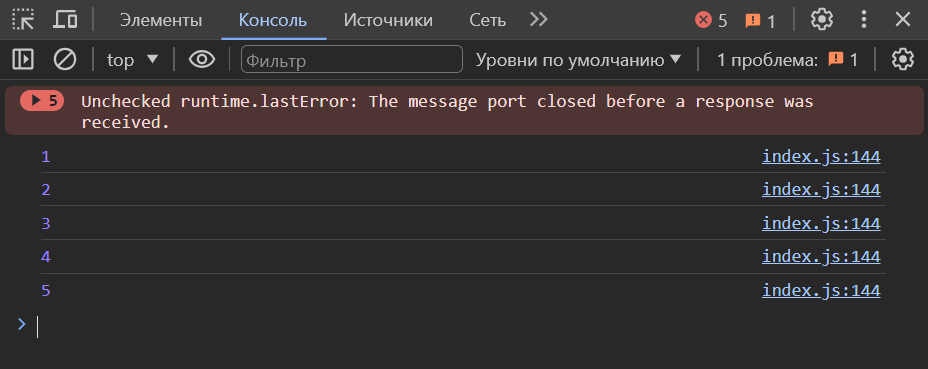
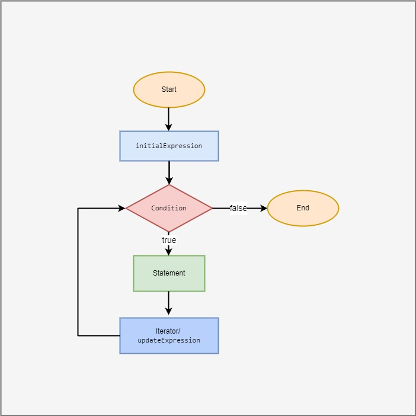
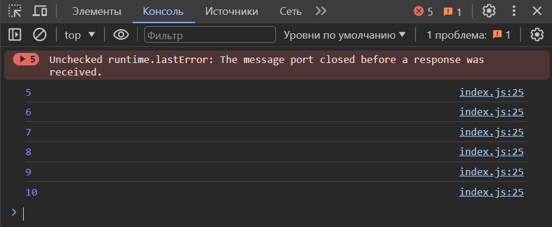
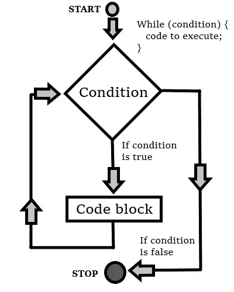
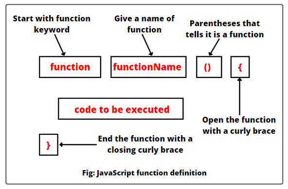

# Loop (qaytarish) JavaScriptda biror amalni bir nechta marta takrorlash uchun ishlatiladi. Looplar asosan 3 turga bo'linadi:

- ### For
- ### While
- ### Do while

### Bularning har birining o'z vazifalari va farqlari bor.

<br><br>

# FOR

1. For loop: biron bir ifodani bir nechta marta takrorlash uchun ishlatiladi. For kalit so'zi bilan boshlanadi va takrorlash blokida shart va qadamlar ko'rsatiladi.
Misol uchun, quyidagi for loop 1 dan 5 gacha bo'lgan sonlarni ekranga chiqaradi:

```
for (let i = 1; i <= 5; i++) {
    console.log(i);
}
```
### Natija quyidagicha bo'ladi



<br>

# For tuzilmasini quyidagicha tasvirlash mumkin



<br><br>

# WHILE

2. While loop: kiritilgan shart bajarilmay qolguncha takrorlanadi. Ya'ni siz kiritgan shartingiz false qiymat qaytardimi while ham ishlashdan to'xtaydi.
Misol uchun, hozirgi misolni while loop da yozilishi quyidagicha bo'ladi:

```
let i = 5;
while (i <= 10) {
    console.log(i);
    i++;
}
```

Bu kod yuqoridagi sonlarni ekranga chiqaradi: 5, 6, 7, 8, 9, 10.



<br>

# While tuzilmasini quyidagicha tasvirlash mumkin



<br><br>

# DO WHILE

3. Do-while loop: avval amal bajaradi, so'ng shartni tekshiradi va shart bajarilishida false qiymat qaytmagunicha takrorlanadi.
Misol uchun, quyidagi do-while loop 10 dan 15 gacha bo'lgan sonlarni ekranga chiqaradi:

```
let i = 10;
do {
    console.log(i);
    i++;
} while (i <= 15);
```
Natija quyidagicha bo'ladi


# Do while tuzilmasini quyidagicha tasvirlash mumkin


<br><br><br>


# Function

<br>

### JavaScriptda funksiya biror amalni bajarish uchun ishlatiladi. Funksiya, bir nechta amallarni birlashtirib bera oladi va unga nom bersa bo'ladi.

# Funksiyaning tuzilishini quyidagicha tasvirlash mumkin

<br>



<br>

## Funksiya quyidagicha yozilishi mumkin

```
function functionName(parameters) {
    // amallar
    return result; // o'zgaruvchi
}
```

## Bu yerda:

- functionName - funksiya nomi (bu nom unikal bo'lishi kerak).
- parameters - funksiya uchun kerak bo'lgan parametrlar (bo'sh bo'lishi mumkin).
- amallar - funksiya bajarishi kerak bo'lgan amallar.
- result - funksiya qaytarishi kerak bo'lgan qiymat (bo'sh bo'lishi mumkin).

<br>

### Funksiyaga misol keltiradigan bo'lsak:

Quyidagi funksiya ikki sonni qo'shadi va natijani qaytaradi:

```
function addNumbers(a, b) {
    let result = a + b;
    return result;
}

let sum = addNumbers(5, 3);
console.log(sum); // 8
```

Bu kod ikki sonni qo'shadi va qaytgan natijani chiqaradi. Funksiyalar JavaScriptda kodni qisqartirish va qayta ishlatishni osonlashtirish uchun ham foydalaniladi.

<br><br>

# JavaScriptda funksiyalarni elon qilishning bir nechta usullari mavjud:


<br>

- Function Declaration (Funksiya E'lon Qilish): Bu usulda funksiyaga nom beriladi va pasda chaqiriladi.

```
function greet(name) {
  console.log("Salom, " + name + "!");
}

greet("Diyor");
```

<br>

- Function Expression (Funksiya Ifodasi): Funksiyalar o'zgaruvchilarga o'zlashtirilib, ularga nom berilmaydi.

```
let greet = function(name) {
  console.log("Salom, " + name + "!");
};

greet("Diyor");
```

<br>

- Arrow Function (Oqimli Funksiya): ES6 da chiqqan yangi funksiya sintaksisi. U qisqa ko'rinishda funksiyani ifodalaydi.

```
let greet = (name) => {
  console.log("Salom, " + name + "!");
};

greet("Diyor");
```