# Loop (qaytarish) JavaScriptda biror amalni bir nechta marta takrorlash uchun ishlatiladi. Looplar asosan 3 turga bo'linadi:

- ### For
- ### While
- ### Do while

### Bularning har birining o'z vazifalari va farqlari bor.

<br><br>

# FOR

1. For loop: biron bir ifodani bir nechta marta takrorlash uchun ishlatiladi. For kalit so'zi bilan boshlanadi va takrorlash blokida shart va qadamlar ko'rsatiladi.
Misol uchun, quyidagi for loop 1 dan 5 gacha bo'lgan sonlarni ekranga chiqaradi:

```
for (let i = 1; i <= 5; i++) {
    console.log(i);
}
```
### Natija quyidagicha bo'ladi

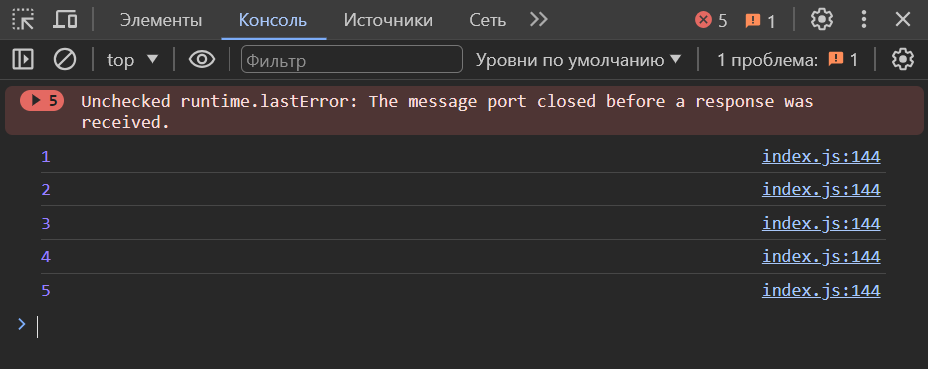

<br>

# For tuzilmasini quyidagicha tasvirlash mumkin

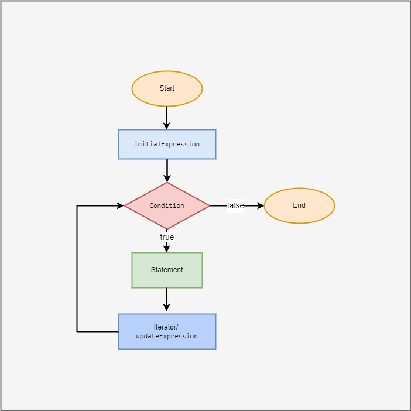

<br><br>

# WHILE

2. While loop: kiritilgan shart bajarilmay qolguncha takrorlanadi. Ya'ni siz kiritgan shartingiz false qiymat qaytardimi while ham ishlashdan to'xtaydi.
Misol uchun, hozirgi misolni while loop da yozilishi quyidagicha bo'ladi:

```
let i = 5;
while (i <= 10) {
    console.log(i);
    i++;
}
```

Bu kod yuqoridagi sonlarni ekranga chiqaradi: 5, 6, 7, 8, 9, 10.

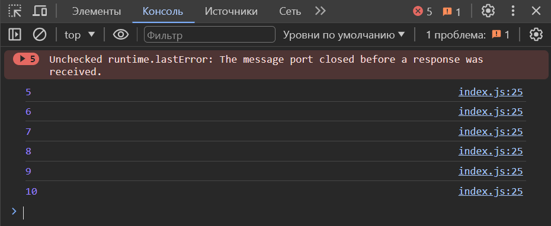

<br>

# While tuzilmasini quyidagicha tasvirlash mumkin

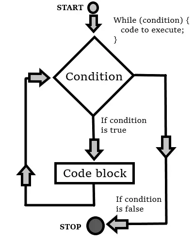

<br><br>

# DO WHILE

3. Do-while loop: avval amal bajaradi, so'ng shartni tekshiradi va shart bajarilishida false qiymat qaytmagunicha takrorlanadi.
Misol uchun, quyidagi do-while loop 10 dan 15 gacha bo'lgan sonlarni ekranga chiqaradi:

```
let i = 10;
do {
    console.log(i);
    i++;
} while (i <= 15);
```
Natija quyidagicha bo'ladi

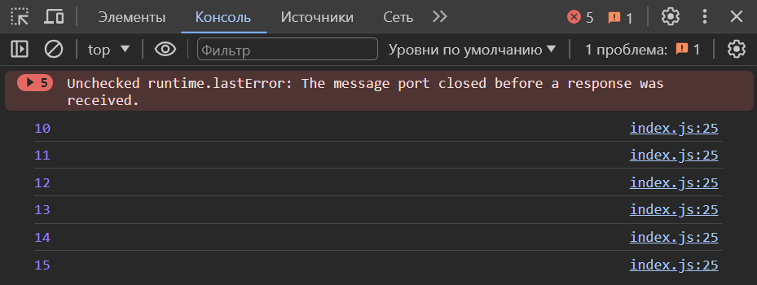

# Do while tuzilmasini quyidagicha tasvirlash mumkin

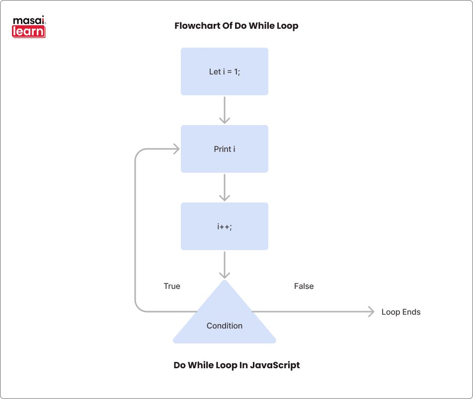

<br><br><br>


# Function

<br>

### JavaScriptda funksiya biror amalni bajarish uchun ishlatiladi. Funksiya bir nechta amallarni birlashtirib bera oladi va unga nom bersa bo'ladi.

# Funksiyaning tuzilishini quyidagicha tasvirlash mumkin

<br>

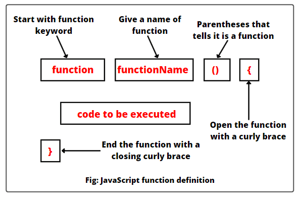

<br>

## Funksiya quyidagicha yozilishi mumkin

```
function functionName(parameters) {
    // amallar
    return result; // o'zgaruvchi
}
```

## Bu yerda:

- functionName - funksiya nomi (bu nom unikal bo'lishi kerak).
- parameters - funksiya uchun kerak bo'lgan parametrlar (bo'sh bo'lishi mumkin).
- amallar - funksiya bajarishi kerak bo'lgan amallar.
- result - funksiya qaytarishi kerak bo'lgan qiymat (bo'sh bo'lishi mumkin).

<br>

### Funksiyaga misol keltiradigan bo'lsak:

Quyidagi funksiya ikki sonni qo'shadi va natijani qaytaradi:

```
function addNumbers(a, b) {
    let result = a + b;
    return result;
}

let sum = addNumbers(5, 3);
console.log(sum); // 8
```

Bu kod ikki sonni qo'shadi va qaytgan natijani chiqaradi. Funksiyalar JavaScriptda kodni qisqartirish va qayta ishlatishni osonlashtirish uchun ham foydalaniladi.

<br><br>

# JavaScriptda funksiyalarni e'lon qilishning bir nechta usullari mavjud:

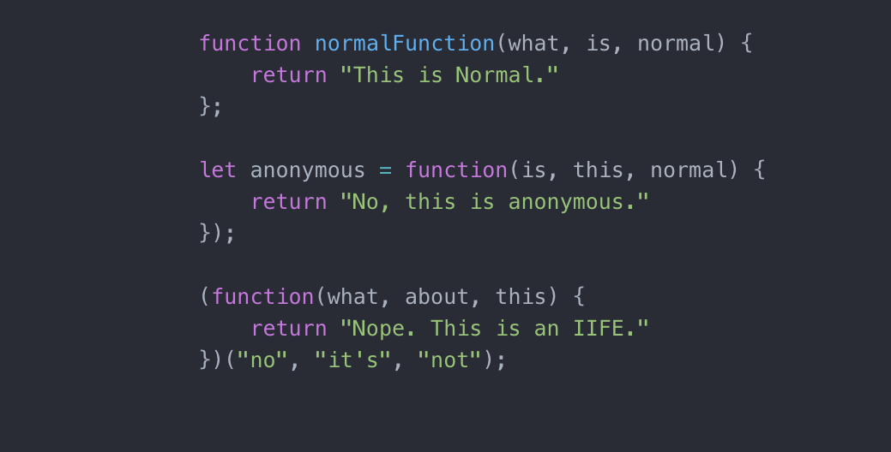

<br>

- Function Declaration (Funksiya E'lon Qilish): Bu usulda funksiyaga nom beriladi va pasda chaqiriladi.

```
function greet(name) {
  console.log("Salom, " + name + "!");
}

greet("Diyor");
```

<br>

- Function Expression (Funksiya Ifodasi): Funksiyalar o'zgaruvchilarga o'zlashtirilib, ularga nom berilmaydi.

```
let greet = function(name) {
  console.log("Salom, " + name + "!");
};

greet("Diyor");
```

<br>

- Arrow Function (Oqimli Funksiya): ES6 da chiqqan yangi funksiya sintaksisi. U qisqa ko'rinishda funksiyani ifodalaydi.

```
let greet = (name) => {
  console.log("Salom, " + name + "!");
};

greet("Diyor");
```

---
---
---

<br><br><br><br><br>

# Loop ga oid qiziqarli misol ishlaymiz.

### Masala sharti quyidagicha

- Ixtiyoriy kiritilgan son ichida kelgan sonlar agar 3 ga ham 5 ga ham qoldiqsiz bo'linsa "FizzBuzz", 3 ga qoldiqsiz bo'linsa "Fizz", 5 ga qoldiqsiz bo'linsa "Buzz", aks holda sonning o'zi chiqarilsin.

```
let son = +prompt("Istagan soningizni kiriting (min: 15)")

for (let i = 1; i <= son; i++) {
    let output = "";
    if (i % 3 === 0) output += "Fizz";
    if (i % 5 === 0) output += "Buzz";
    console.log(output || i);
  }
```

Javobi quyidagicha bo'ladi:

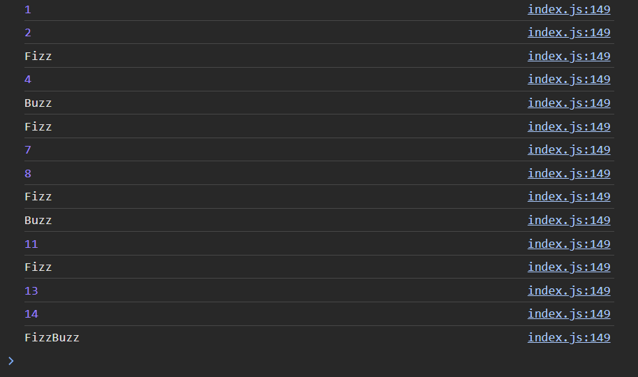

Masala haqida batafsil to'xtaladigan bo'lsak, son degan o'zgaruvchiga foydalanuvchi tomonidan ixtiyoriy son kiritiladi (tavsiya etiladi min=15), for loop ichida `output` o'zgaruvchisi e'lon qilinadi, so'ngra for loop yordamida 1 dan `son` gacha bo'lgan sonlar ichidan 3 ga qoldiqsiz bo'linadigan sonlar `Fizz`, 5 ga qoldiqsiz bo;linadigan sonlar `Buzz`, 3 ga ham 5 ga ham qoldiqsiz bo'linadigan sonlar `FizzBuzz`, qolgan sonlarning o'zi `output` ga o'zlashtiriladi va `console` ga chiqariladi.

# For loop ga oid bir osonroq misol keltirsak:

### Masala sharti quyidagicha

-  1 dan 10 gacha bo'lgan juft sonlar chiqarilsin.

```
for (let i = 2; i <= 10; i += 2) {
  console.log(i);
}
```
Bu yerda `i` ga boshlang'ich qiymat sifatida 2 teng deb olindi va har shart bajarilganda 2 o'zlashtirib boriladi. Agar siz 10 sonini ixtiyoriy qilmoqchi bo'lsangiz bir o'zgaruvchi kiritib olishingiz kerak bo'ladi. Ya'ni `let number = +prompt('Ixtiyoriy son')` va 10 sonini o'rniga `number` o'zgaruvchisini qo'yib ketishingiz kerak bo'ladi.

```
let number = +prompt('Ixtiyoriy son')

for (let i = 2; i <= number; i += 2) {
  console.log(i);
}
```

# While loop ga oid bir osonroq misol keltirsak:

### 5 dan 1 gacha bo'lgan sonlar teskari tartibda chiqarilsin.

```
let i = 5;
while (i >= 1) {
  console.log(i);
  i--;
}
```

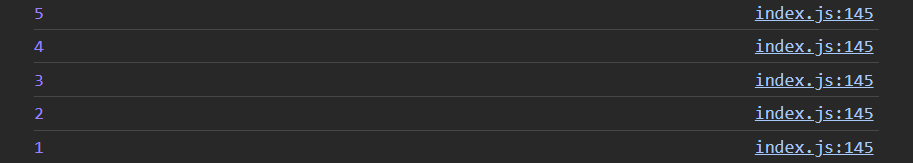

Tabiiyki, boshqa misollardan ajralib turadigan jihatlaridan biri asosan `i--` degan joyidir, chunki ko'p hollarda `i++` ko'rinishda keladi.

Bu masalada 5 ni ixtiyoriy son qilish uchun quyidagicha `code` yoziladi:

```
let i = +prompt("Ixtiyoriy son kiriting:");

while (i >= 1) {
  console.log(i);
  i--;
}
```

# Do while da yuqoridagi misol ishlab ko'ramiz

```
let i = 5;
do {
  console.log(i);
  i--;
} while (i >= 1);
```

Bu kod `do` blokini bajaradi, keyin shartni tekshiradi va agar shart bajarilgan bo'lsa, qaytadan "do" blokini bajaradi. Shart bajarilmaganligi yoki bajarilganligini "do-while" loop bajariladi. Natijada, konsolga 5 dan 1 gacha teskari tartibdagi sonlar chiqadi.

<br><br><br>

# Function 

### Funksiya haqida batafsil ma'lumotlarni yuqorida keltirib o'tganmiz, keling endi shunga doir bir nechta misollar ishlab ko'ramiz

1.  Ikki sonning yig'indisini hisoblash uchun funksiya tuzilsin.

```
function sum(a, b) {
  return a + b;
}

let result = sum(5, 3);
console.log(result); // 8
```

# Return

`return` haqida ba'tafsil aytadigan bo'lsak, `return` operatori funksiyadan qiymat qaytarish uchun ishlatiladi. Bu operator funksiya ichidagi barcha amallar bajarilganidan so'ng, funksiyaga aniq bir qiymat tayinlab beradi desak mubolag'a bo'lmaydi. `return` operatoridan so'ng kod bajarilmasa, funksiya qayta chaqirilgan joyga qaytmasligi mumkin.

Yuqoridagi misolda return `a + b` ning qiymatini funksiyaga yuklaydi va funksiyaning qiymati returndagi qiymatga teng bo'ladi. So'ngra `console.log` ga funksiyani kiritishimiz mumkin bo'ladi.

2. Sonning juft yoki toq ekanligini tekshirish uchun funksiya.

```
function isEven(num) {
  return num % 2 === 0;
}

console.log(isEven(4)); // true
console.log(isEven(7)); // false
```

3. 100 gacha bo'lgan sonlar yig'ingisini hisoblash uchun funksiya.

```
function sumNumbersUpTo100() {
  let sum = 0;
  for (let i = 1; i <= 100; i++) {
    sum += i;
  }
  return sum;
}

let result = sumNumbersUpTo100();
console.log(result); // 5050
```
Bu kodlar 100 gacha bo'lgan sonlarning yig'indisini hisoblab beradi. 100 ning o'rniga ixtiyoriy son qo'yish uchun quyidagicha kod yoziladi

```
let num = +prompt("Ixtiyoriy son kiriting:")
function sumNumbersUpToN() {
  let sum = 0;
  for (let i = 1; i <= N; i++) {
    sum += i;
  }
  return sum;
}

let result = sumNumbersUpToN(num);
console.log(result); // Natija
```

<br><br><br>

# Array (Massiv)

### Massivlar JavaScriptda keng qo'llaniladi va ko'p funksiyalarda ishlatiladi. Ular o'zgaruvchilarni saqlash, ma'lumotlarni tahlil qilish va ko'p qismlarini boshqarish uchun juda qulaydir.

### Tushunarliroq bo'lishi uchun quyidagi misollarni ko'ramiz

- `let types = ["string", "boolean", "number"]`
- `let variables = ["variable", "true", "false"]`
- `let numbers = ["5", "1", "45"]`

### Massivlarni e'lon qilish usullari:

- Literal Usul: Eng oddiy usul, kvadrat qavs ochiladi va elementlar vergullar bilan ajratiladi.

`let types = ["string", "boolean", "number"]`

- Array() Konstruktori: new operatori bilan ishlatiladi va elementlar argumentlar sifatida beriladi.

`let numbers = new Array(1, 2, 3, 4, 5);`

- Elementlarsiz bo'sh massiv yaratish.

`let emptyArray = [];`

- Array.of() Metodi: Berilgan argumentlarni elementlar sifatida qabul qilib, massiv yaratadi.

`let nums = Array.of(1, 2, 3, 4, 5);`

- Array.from() Metodi: Tartiblanmagan ma'lumotlar to'plamidan massiv yaratish.

`let str = "hello";
let chars = Array.from(str);`

### Har bir usulning o'ziga xos qulayliklari va foydalanish shakllari mavjud. Ko'pincha, birinchi usul, yani literal usul eng ko'p qo'llaniladi va juda sodda.

<br><br>

# Array metodlari

- `push()`: Massivning oxiriga yangi element qo'shadi.

```
let fruits = ["olma", "banan"];
fruits.push("shaftoli");
// fruits: ["olma", "banan", "shaftoli"]
```

- `pop()`: Massivning oxiridagi elementni olib tashlaydi.

```
let fruits = ["olma", "banan", "shaftoli"];
let lastFruit = fruits.pop();
// lastFruit: "shaftoli", fruits: ["olma", "banan"]
```

- `shift()`: Massivning boshidagi elementni olib tashlaydi.

```
let fruits = ["olma", "banan", "shaftoli"];
let firstFruit = fruits.shift();
// firstFruit: "olma", fruits: ["banan", "shaftoli"]
```

- `unshift()`: Massivning boshiga yangi element qo'shadi.

```
let fruits = ["banan", "shaftoli"];
fruits.unshift("olma");
// fruits: ["olma", "banan", "shaftoli"]
```

- `slice()`: Massivdan bir qismni ko'chirib olish uchun ishlatiladi.

```
let fruits = ["olma", "banan", "shaftoli", "anor"];
let citrus = fruits.slice(2);
// citrus: ["shaftoli", "anor"], fruits: ["olma", "banan", "shaftoli", "anor"]
```

- `splice()`: Massivda biror elementlarni o'zgartirish uchun ishlatiladi.

```
let fruits = ["olma", "banan", "shaftoli", "anor"];
fruits.splice(2, 1, "apelsin");
// fruits: ["olma", "banan", "apelsin", "anor"]
```

### Bu faqat ba'zi metodlardir, JavaScriptda massivlar bilan ishlashning yana ko'p usullari mavjud.


<br><br><br>

# Object

### JavaScriptda obyektlar degani `keys` va qiymatlar jamlanmasini ifodalaydigan ma'lumot turi hisoblanadi. Obyektning har bir `key` si bir qiymatga mos keladi. Quyidagi misolda bir obyektni qanday yaratish va unga qanday murojaat qilishni ko'rsataman:

```
// Obyekt yaratish
let person = {
  name: "Mirabbos",
  age: 22,
  city: "Tashkent"
};

// Obyektning kalitlariga murojaat qilish
console.log(person.name); // "Mirabbos"
console.log(person.age); // 22
console.log(person.city); // "Tashkent"

// Obyektning kalitlarini o'zgartirish
person.age = 23;

// Yangi kalit qo'shish
person.job = "Developer";

// Obyektning yangilangan versiyasini chiqarish
console.log(person); // { name: "Mirabbos", age: 23, city: "Tashkent", job: "Developer" }
```

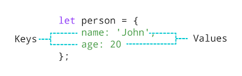

### Obyektlarning qiymatlariga murojaat qilish uchun massivlarga o'xshab indekslar ishlatilmaydi, ammo o'rniga `key` nomi yoziladi. Obyektning har bir `key`si uning qiymatiga mos keladi. `keys` string, number yoki boshqa ma'lumot turlari bo'lishi mumkin. 

<br>

## JavaScriptda obyekt elon qilishning ikkita asosiy usuli mavjud:

1. Literal Usul: Eng oddiy usul, obyektni yaratish uchun o'zgaruvchiga kvadrat qavs ichida `keys` va ularning qiymatlari beriladi.

```
let person = {
  name: "Jo"Mirabbos",
  age: 22,
  city: "Tashkent"
}
```

2. Konstruktor Funksiyasi Orqali: Object konstruktor funksiyasidan foydalanib obyekt yaratish.

```
let person = new Object();
person.name = "Mirabbos";
person.age = 22;
person.city = "Tashkent";
```

### Eng ko'p ishlatiladigan usul literal usulidir, chunki uning syntaxi oddiy va qulay. Konstruktor funksiyasidan foydalanish esa ba'zi holatlarda kerak bo'ladi, masalan, dastur davomida yangi obyektlarni dinamik ravishda yaratish kerak bo'lganda.

### Object ichida `object`, `array` va `function` lar ham kelishi mumkin.

```
let person = {
  name: "Mirabbos",
  age: 22,
  hobbies: ["listening music", "play game", "coding"],
  greet: function() {
    console.log("Hello, my name is " + person.name + ".");
  }
};

console.log(person.name); // "Mirabbos"
console.log(person.hobbies[0]); // "Listening music"
person.greet(); // "Hello, my name is Mirabbos."
```
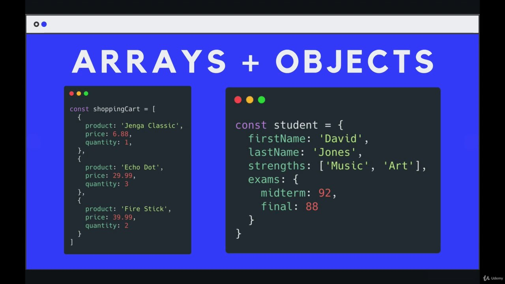